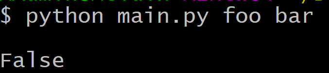
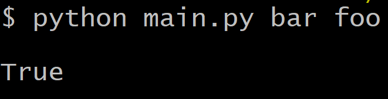
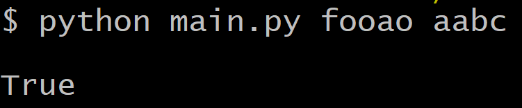

# kg_melkaj_2020
Coding assessment for KG

While working on this assignment, I assumed it was ok for the user to enter in strings that were not of the same length

The main part of the approach was to find out how many unique characters were in each string. If the amount of unique characters in string one were the same, if not more, than in string two, the program will return True.

If the second string had more unique characters than the first string, then the program would return False

From what I gathered, it seemed that the only thing to stop a pair of strings from being mapped was if the second string had more unique characters.

Test 1:

Test 2:

Test 3:

